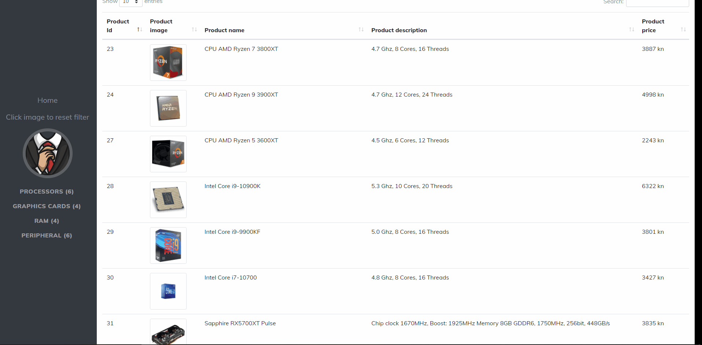

# Mr-Robot-Webshop

Concept of a webshop created using modern technologies. 
It uses .NET core as the backend, MS SQL Server 2019 for the database and Jquery as the backend

How to set up: 

Step 1: Import dumped database under /database resources

Step 2: Start .NET Core backend

Step 3: Open html file or run html on local server and enjoy

Additional: import Postman collection to play with more backend options

Data needed for app to work is already included if you import the database with data in it.
