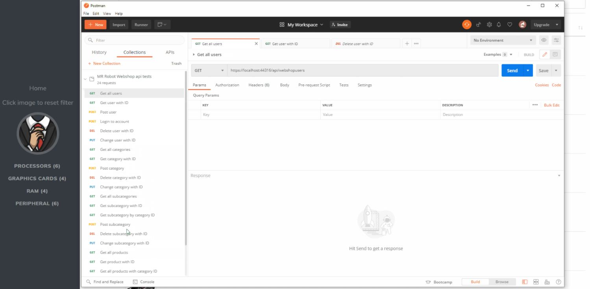
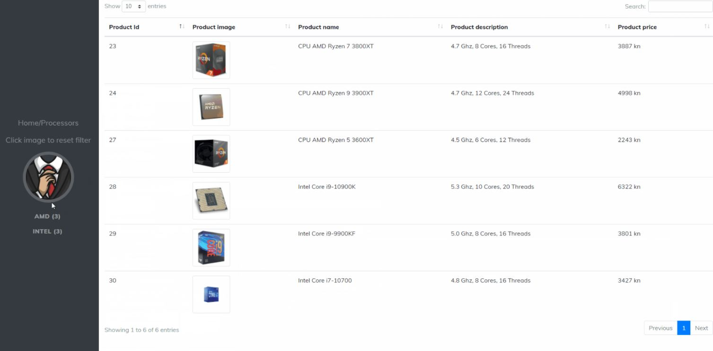
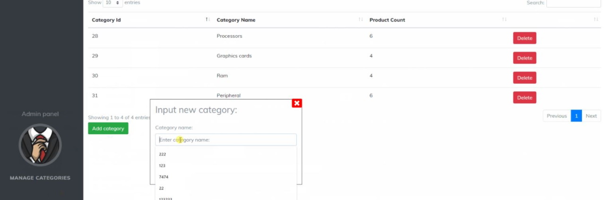

# Mr-Robot-Webshop

Webshop created using modern technologies. 
It uses MS SQL Server 2019 as the database and Entity Framework to communicate with it in the backend.

The backend is created using .NET Core.

The frontend is created using HTML/CSS (Bootstrap, FontAwesome), Javascript and JQuery. 

If you understand Croatian and want to read the seminar it is available here:
https://docs.google.com/document/d/1U65I8oJdH2-q8ZfGdW-ch1LzSc-LAOjqcYXwpidKxiE/edit?usp=sharing

